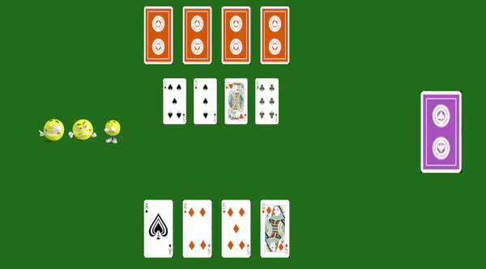
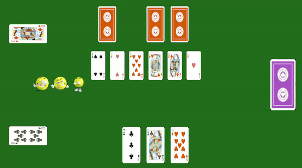
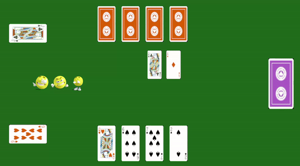
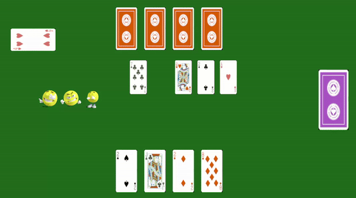
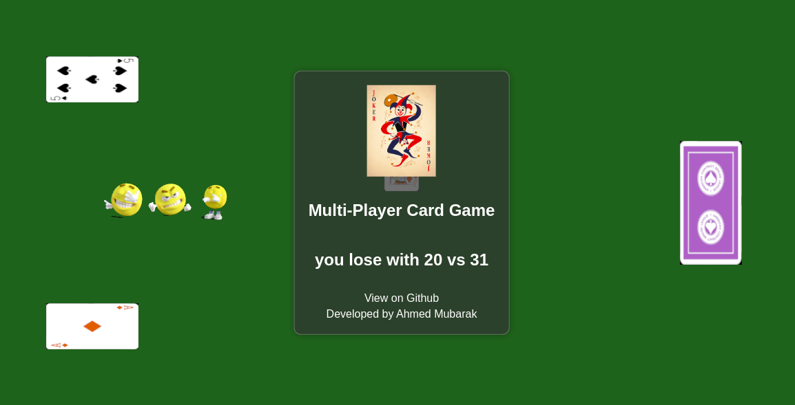

---

# Card Game Guide

Welcome to the exciting world of our card game! This guide will walk you through the rules and mechanics of the game.

## Game Overview

The objective of the game is to accumulate the highest number of cards by the end. Players take turns drawing cards, playing special cards, and forming combinations to collect cards from the board.

## Card Types

- **Number Cards (2-10):** Represented by their numeric value.
- **Ace:** is dealt with as a 1.
- **Face Cards (J, Q, K)**

## Setup

1. Each player is dealt an initial hand of cards (4 cards per player).
2. The remaining cards form the deck.
3. The board is initialized with four cards at the beginning.

## Player Turns

1. **Draw Card:** At the beginning of their turn, a player draws a card from the deck.

2. **Play Matching Cards:** If the player has a card whose number matches a card on the board, they can take that card.

   

3. **Play Combination:** If there is a combination of two or more cards on the board whose sum is equal to the player's card, they can take all valid combination cards.

   

4. **No Match or Combination:** If there is no match or combination, the player's card is placed on the board.

   
  
  5.**Playing J Card:** If player play J and there cards on board
  

5. The player's turn ends, and it's the next player's turn.

## End of the Game

The game continues until the deck is empty. The player with the highest number of cards is the winner!

